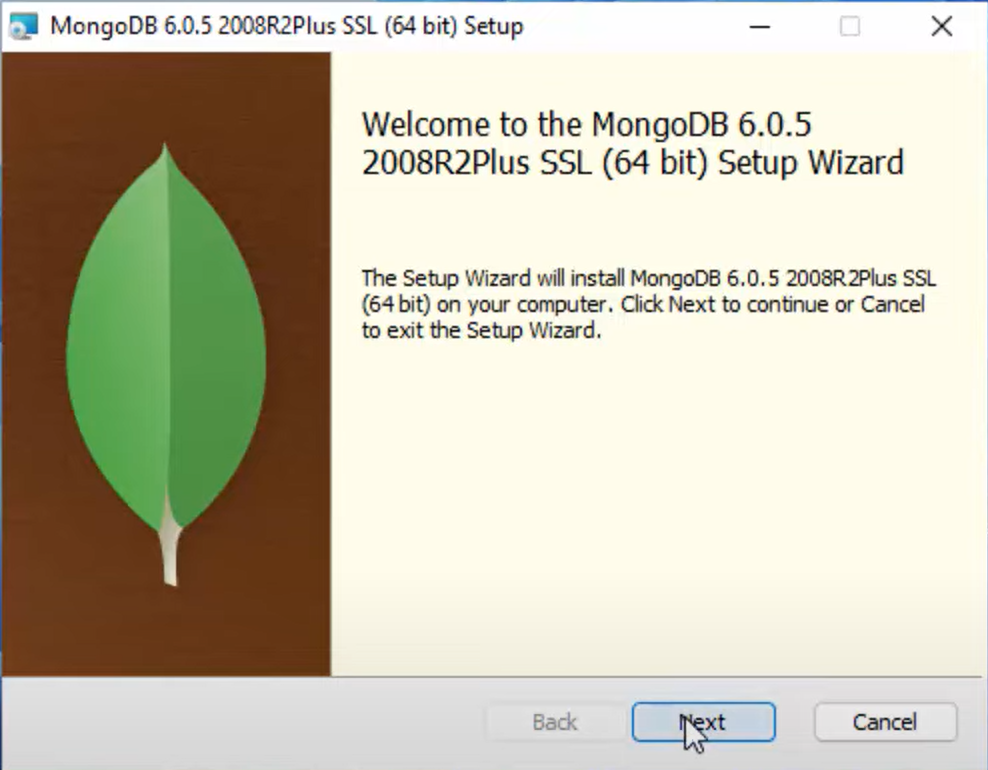
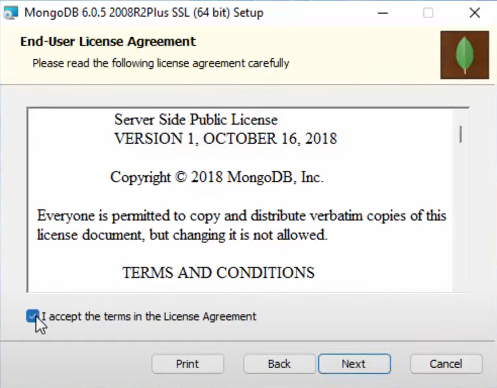
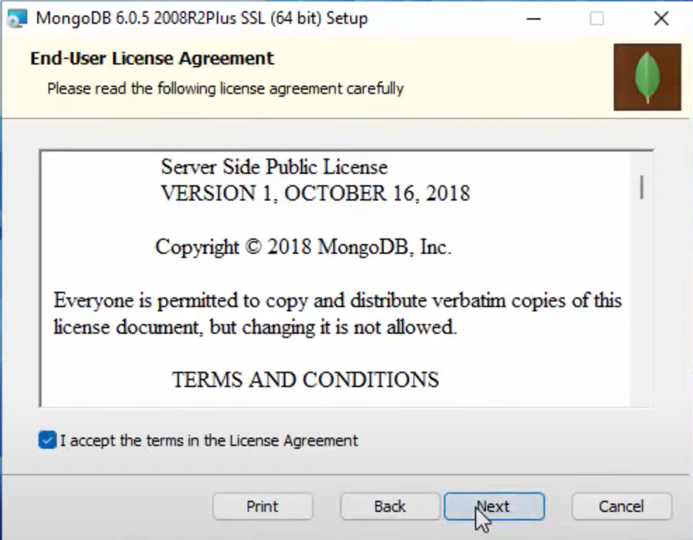
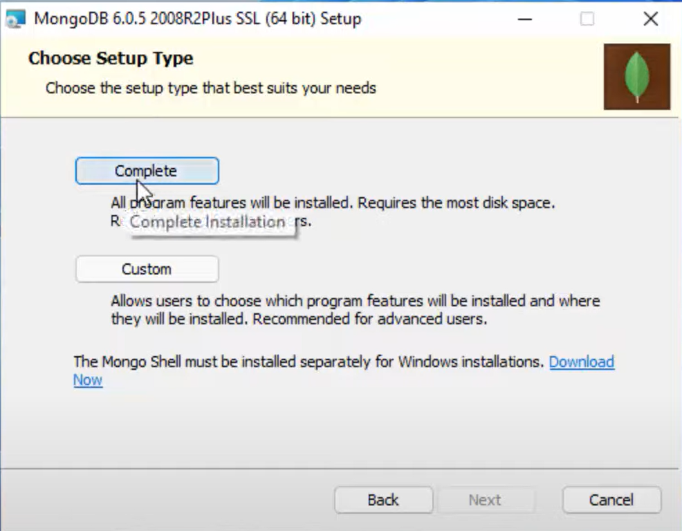
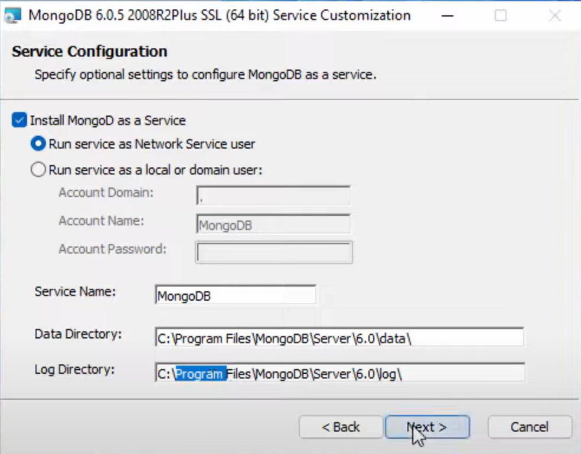
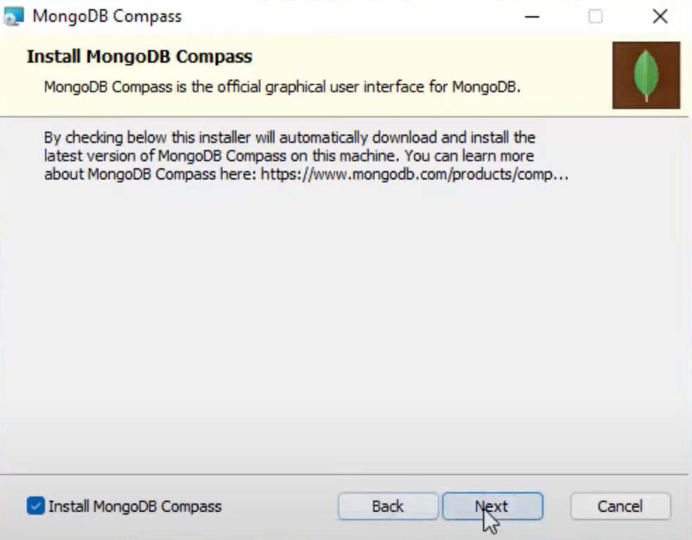
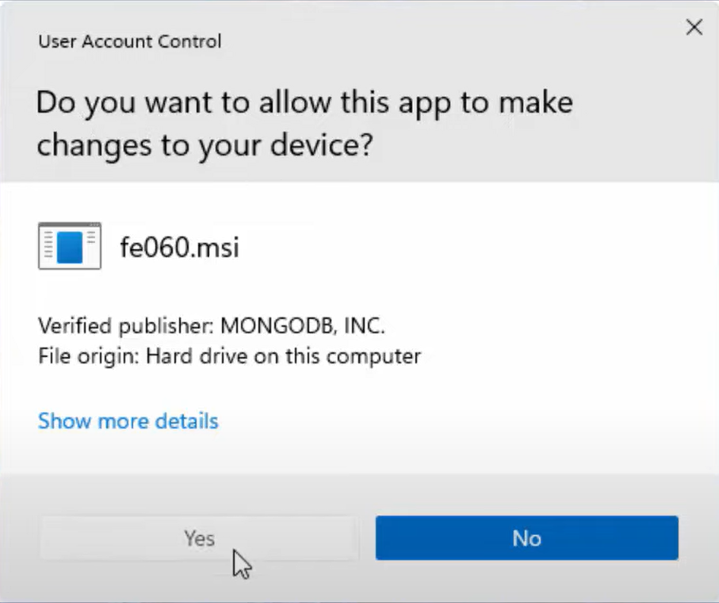
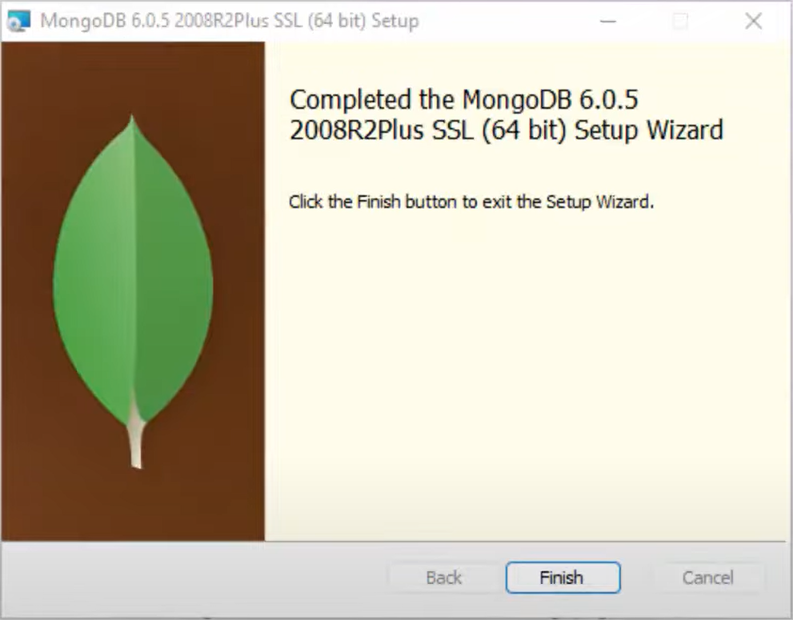
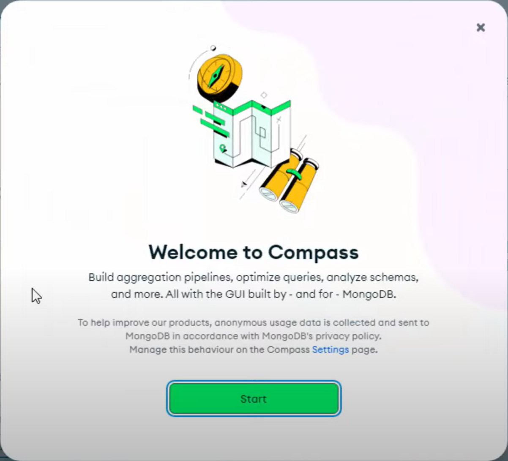
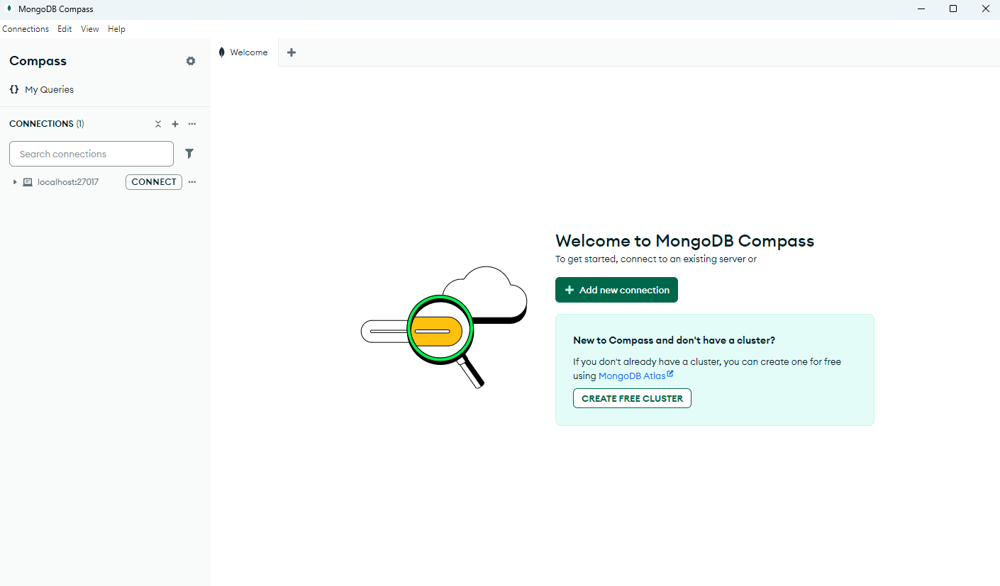

# Installationsanleitung

## Schritt 1 (ZIP-Datei entpacken)
Entpacken Sie die ZIP-Datei `"Programmentwurf_Atussa_Chiara_Lukas_Nils.zip"`

## Schritt 2 (Node.js)
Stellen Sie sicher, dass Node.js (mindestens Version 12 oder höher installiert ist)

## Schritt 3 (Abhängigkeiten installieren)
**1.** Öffnen Sie ein Terminal und wechseln Sie in das Projektverzeichnis, in dem die Datei entpackt wurde.
**2.** Führen Sie anschließend den Befehl aus.
~~~bash
npm install
~~~

### Schritt 4 (MongoDB)
**1.** Laden Sie MongoDB Community über folgenden Link herunter: https://www.mongodb.com/try/download/community
**2.** Führen Sie die heruntergeladene Datei
**3.** Wählen Sie `"Next"`

**4.** Akzeptieren Sie die Lizenzbedingungen

**5.** wählen Sie `"Next"`

**6.** Wählen Sie `"Complete"`

**7.** Wählen Sie jeweils ein passendes Data- und Log Directory und setzen Sie die anderen Einstellungen wie folgt:

**8.** Wählen Sie `"Install MongoDB Compass"`, dann `"next"`

**9.** Lassen Sie zu, dass das Programm änderungen an ihrem Gerät vornimmt. Eventuell ist der Name ein anderer.

**10.** Warten Sie den Installationsprozess ab und wählen `"Finisch"`

**11.** Nun öffnet sich die Applikation MongoDB Compass. Wählen Sie `"Start"`

**12.** Nun muss eine neue Verbindung eingerichtet werden. Wählen Sie dafür `"Add new connection"`

**13.** Hier müssen nun keine Änderungen vorgenommen werden. Wählen Sie `"Save & Connect"`