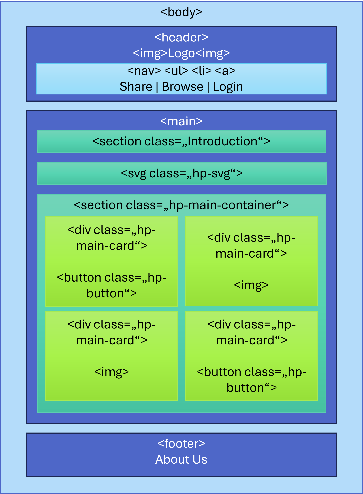
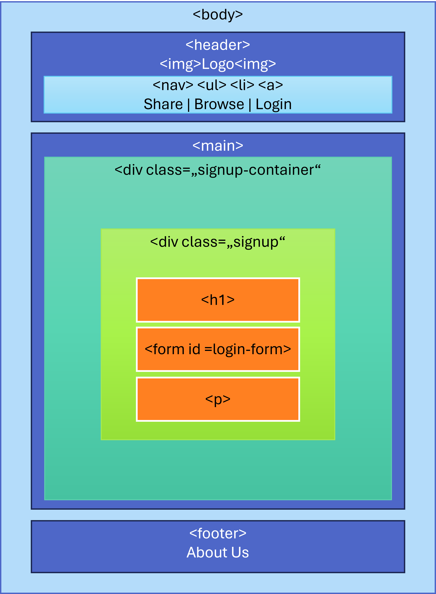
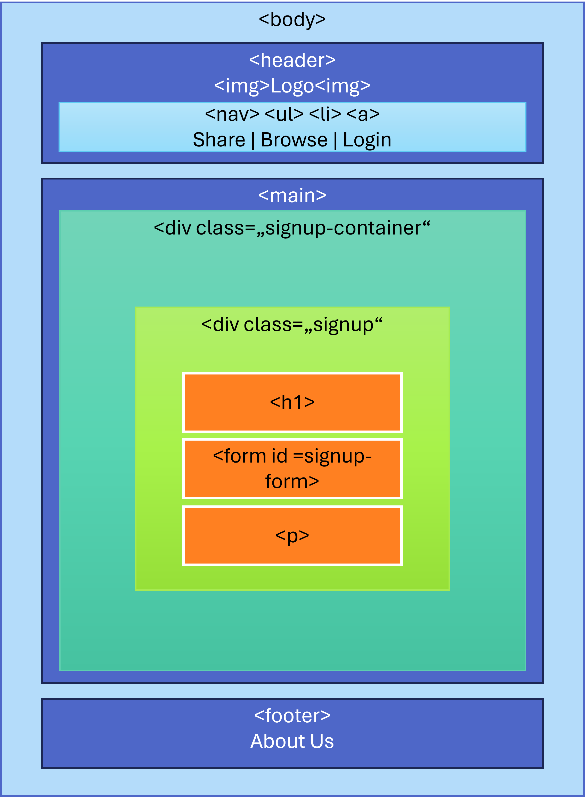
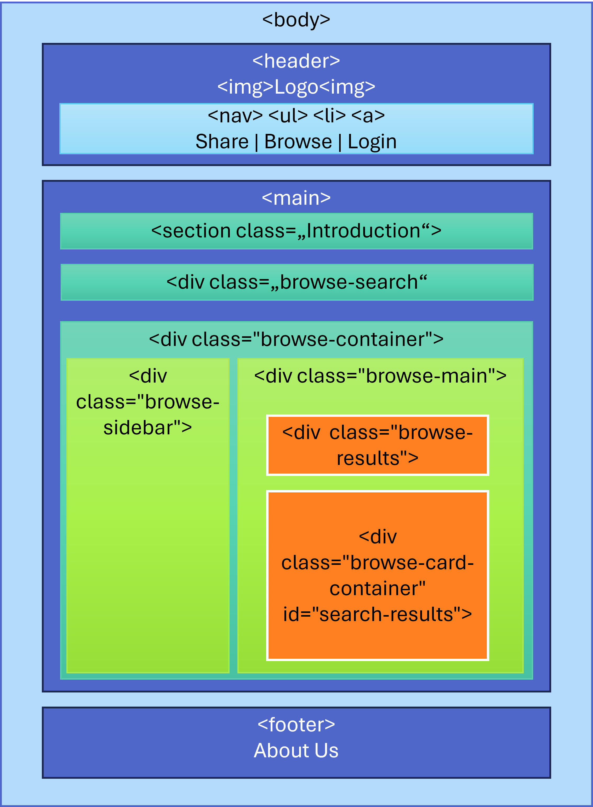
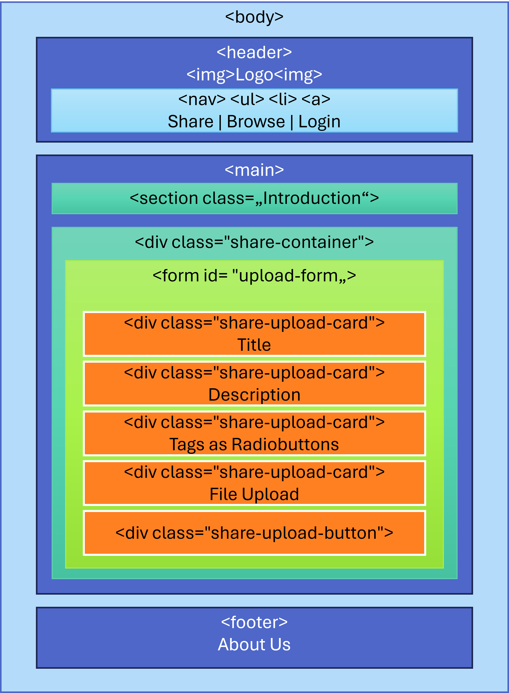

# StudyBuddy

## Inhalts- und Dateiverzeichnis
- [StudyBuddy](#studybuddy)
  - [Inhalts- und Dateiverzeichnis](#inhalts--und-dateiverzeichnis)
  - [Frontend: HTML und CSS](#frontend-html-und-css)
    - [Zieldefinition](#zieldefinition)
    - [Erster Entwurf](#erster-entwurf)
  - [Hypertext Markup Language (HTML)](#hypertext-markup-language-html)
    - [Sitemap](#sitemap)
    - [Kompositionsdiagramme](#kompositionsdiagramme)
      - [Kompositionsdiagramm Homepage](#kompositionsdiagramm-homepage)
      - [Kompositionsdiagramm Login und Signup](#kompositionsdiagramm-login-und-signup)
      - [Kompositionsdiagramm Impressum](#kompositionsdiagramm-impressum)
      - [Kompositionsdiagramm Browse](#kompositionsdiagramm-browse)
      - [Kompositionsdiagramm Share](#kompositionsdiagramm-share)
  - [Cascading Style Sheet (CSS)](#cascading-style-sheet-css)
    - [Aufbau des Codes](#aufbau-des-codes)
    - [Erläuterung eines Code-Beispiels](#erläuterung-eines-code-beispiels)
      - [Auszug HTML-Code zu .hp-button](#auszug-html-code-zu-hp-button)
      - [Auszug CSS-Code zu .hp-button](#auszug-css-code-zu-hp-button)
      - [Erklärung Funktionsweise](#erklärung-funktionsweise)
    - [Responsives Design](#responsives-design)
      - [Breakpoints](#breakpoints)
      - [Umsetzung der Responsivität](#umsetzung-der-responsivität)
  - [Serverseitige Implementierung](#serverseitige-implementierung)
    - [Grundsätzliche Anforderungen](#grundsätzliche-anforderungen)
    - [Server-Einstiegspunkt `app.js`](#server-einstiegspunkt-appjs)
    - [Routing und API-Endpunkte](#routing-und-api-endpunkte)
      - [`browse.js`](#browsejs)
      - [`uploadRoute.js`](#uploadroutejs)
      - [`userRoutes.js`](#userroutesjs)
    - [Datenzugriff und Modellinteraktion](#datenzugriff-und-modellinteraktion)
      - [Praxisbezogene Optimierungen](#praxisbezogene-optimierungen)
      - [`userModel.js`](#usermodeljs)
      - [`docModel.js`](#docmodeljs)
  - [Hilfsmittel](#hilfsmittel)
    - [Literatur](#literatur)
    - [Artificial Intelligence](#artificial-intelligence)
    - [Webseiten und -applikationen](#webseiten-und--applikationen)
    - [Weitere Anwendungen](#weitere-anwendungen)
  - [Abbildungsverzeichnis](#abbildungsverzeichnis)
      - [Abb. 1: Erster Entwurf der Homepage](#abb-1-erster-entwurf-der-homepage)
      - [Abb. 2: Sitemap](#abb-2-sitemap)
      - [Abb. 3: Kompositionsdiagramm Homepage](#abb-3-kompositionsdiagramm-homepage)
      - [Abb. 4: Kompositionsdiagramm Login](#abb-4-kompositionsdiagramm-login)
      - [Abb. 5: Kompositionsdiagramm Signup](#abb-5-kompositionsdiagramm-signup)
      - [Abb. 6: Kompositionsdiagramm Impressum](#abb-6-kompositionsdiagramm-impressum)
      - [Abb. 7: Kompositionsdiagramm Browse](#abb-7-kompositionsdiagramm-browse)
      - [Abb. 8: Kompositionsdiagramm Share](#abb-8-kompositionsdiagramm-share)
  - [Stichwortverzeichnis](#stichwortverzeichnis)


<details>
  <summary>
  Dateiverzeichnis
  <!--Still has to get updated with actual files-->
  </summary>

~~~console
/StudyBuddy
|-- /config
|   |-- config.js
|   |-- nginx.conf
|
|-- /src
|   |-- /controllers
|   |   |-- userController.js
|   |   |-- productController.js
|   |
|   |-- /models
|   |   |-- userModel.js
|   |   |-- productModel.js
|   |
|   |-- /routes
|   |   |-- userRoutes.js
|   |   |-- productRoutes.js
|   |
|   |-- /middleware
|   |   |-- authMiddleware.js
|   |   |-- errorHandling.js
|   |
|   |-- /utils
|   |   |-- helper.js
|   |
|   |-- app.js
|
|-- /public
|   |-- /css
|   |   |-- main.css
|   |
|   |-- /js
|   |   |-- main.js
|   |
|   |-- /images
|   |   |-- logo.png
|
|-- /scripts
|   |-- migrate.js
|   |-- seed.js
|
|-- /static
|   |-- /html
|   |   |-- index.html
|   |   |-- user.html
|   |   |-- product.html
|
|-- .env
|-- .gitignore
|-- package.json
|-- package-lock.json
|-- README.md
~~~
</details>

## Frontend: HTML und CSS
Mithilfe von HTML und CSS können die Struktur, der Inhalt und das Design von Webseiten
erstellt werden. Beide Sprachen arbeiten Hand in Hand, um einen ansprechenden und funktionalen 
Web-Auftritt zu erstellen.

Dieses Kapitel beschreibt den Entwicklungsprozess von StudyBuddy hinsichtlich der Sprachen HTML und CSS.
Es betrachtet die Entstehung von der Zieldefinition über den ersten Webseitenentwurf
bis hin zur finalen Gestaltung. Zudem werden die eingesetzten Hilfsmittel beschrieben, die 
diesen Prozess begleitet haben. Weiterhin wird anhand ausgewählter Code-Beispiele
die Funktionsweise des Codes erläutert.

### Zieldefinition

Für das Design der Wep-Applikation "StudyBuddy" hat sich das Team folgende Ziele gesetzt,
damit die Bedürfnisse der Zielgruppe Schüler und Studenten*innen optimal erfüllt werden:

- **Übersichtlichkeit und Klarheit:**   
    Zweck der Website ist u. A. Schüler*innen und Studierende beim Lernen zu unterstützen.
    Dabei kann das Lernen für Prüfungen mit unter eine emotionale Belastung darstellen. 
    Sei es der Leistungsdruck, der gefühlte Zwang sich mit Themen auseinander zu setzen, 
    für die man wenig bis kein Interesse aufbringen kann oder die Überforderung bei dem 
    Versuch ein neues Thema zu verstehen, das unbegreiflich scheint.   
    Aus diesem Grund soll StudyBuddy eine übersichtliche und klare Gestaltung haben, 
    damit die Applikation einfach zu bedienen ist und keinen weiteren Stress im Lernprozess bedingt.

- **Ansprechendes, durchgängiges Farbdesign:**  
    Die farbliche Gestaltung des Web-Auftritts soll eine stressfreie, motivierende und 
    konzentrationsfördernde Atmosphäre schaffen. Deshalb fokussiert sich die Farbauswahl
    auf Blau- und Lilatöne. Diese zeichnen sich nach der PAD-Theorie[^1] durch eine beruhigende physiologische und
    emotionale Stimulation, sowie durch eine angenehme Farbwahrnehmung aus.[^2]  
    Weiterhin wurden im :root-Element Farben für das User-Interface definiert, die auf den Webseiten angewendet werden. 
    Dadurch ergibt sich ein einheitliches und konstantes Farbbild.

- **Flexible Navigation:**
    Den Nutzer*innen soll eine flexible Navigation zwischen der Hauptseite und den Unterseiten ermöglicht werden. 
    Dadurch soll eine möglichst effiziente Nutzung der Website gewährleistet werden.
  


[^1]: Die PAD-Theorie (Pleasure-Arousal-Dominance-Theorie) aus der Farbpsychologie beschäftigt sich mit der Wirkung von Farben. Pleasure beschreibt, wie angenehm oder unangenehm eine Farbe empfunden wird. Arousal zeigt die physiologische und emotionale Stimulation. Dominance stellt dar, wie stark eine Farbe ein Gefühl von Kontrolle oder Macht vermittelt. 

[^2]: vgl. Valdez, P., & Mehrabian, A. (1994). Effects of color on emotions. Journal of Experimental Psychology: General, 123(4), 394–409

### Erster Entwurf

Zu Beginn des Projekts wurde ein erster Entwurf der Homepage erstellt. 
Dafür wurde das Design-Programm [Figma](#webseiten-und--applikationen) genutzt. Damit war es möglich, als Team gemeinsam 
an einem Entwurf zu arbeiten.

[**Abbildung 1**](#abb-1-erster-entwurf-der-homepage) stellt den ersten Entwurf dar.

Bereits beim initialen Design wurde die Auffassung geteilt, dass die Homepage möglichst 
übersichtlich gestaltet sein soll. Dazu gehörte, dass sich das Design auf die Funktionen 
Up- und Download (später umbenannt in Share und Browse) ausrichtet, denn diese bilden die 
Hauptfunktionen der Webapplikation.

Weiterhin wurde sich für den Namen "StudyBuddy" entschieden, da die Applikation genau dies für 
ihre Nutzenden darstellen soll - eine angenehme, positive Unterstützung beim Lernen. Außerdem impliziert
"Buddy" - im Sinne von Freund - dass man mit anderen Lernenden zusammenarbeiten kann, indem man 
seine Lernunterlagen austauscht.

Abweichend vom ursprünglichen Entwurf wurde die Farbauswahl getroffen. Wie in der Einleitung 
beschrieben, wurden Blau- und Lilatöne als Hauptfarben definiert.  
Zudem wurden Anpassungen bei den Bildern vorgenommen. Wie in Abbildung 1 zu sehen ist, wirken 
die ersten Grafiken tendenziell kalt und wenig ansprechend. Deshalb wurden mit 
[Microsoft Designer](#artificial-intelligence) neue Bilder generiert.  
Eine weitere Veränderung ist, dass die Verlinkung zu "About Us", also dem Impressum, nicht mehr 
im Header zu finden ist. Da diese Unterseite keine der Hauptfunktionen von StudyBuddy
beinhaltet, wurde die Verknüpfung im footer der Webseiten aufgenommen.

Hiermit wurde der initiale Entwurf des Webseiten-Designs aufgezeigt. 
Im folgenden Teil wird auf die Erstellung der Struktur und des Inhalts mittels HTML
eingegangen. Anschließend wird die Gestaltung mit CSS dokumentiert.


## Hypertext Markup Language (HTML)

Die Hypertext Markup Language (HTML) ist eine standardisierte Sprache zur 
Erstellung von Webseiten. Mit ihr können die Struktur und die Inhalte einer 
Webseite programmiert werden. 

Dieses Kapitel beschäftigt sich mit der HTML-Programmierung von StudyBuddy.
Dabei wird zuerst auf die Sitemap der Webapplikation eingegangen, um ein 
grundsätzliches Verständnis für die Verknüpfung der Webseiten zu schaffen. Anschließend wird
deren Aufbau mittels Kompositionsdiagramme dargestellt.
Abschließend wird anhand eines Code-Beispiels die Funktionsweise aufgezeigt.

### Sitemap

[**Abbildung 2**](#abb-2-sitemap) zeigt die Sitemap von StudyBuddy.

Die Homepage stellt den Ausgangspunkt der Webapplikation dar. Von dort ermöglicht die Struktur eine bidirektionale Navigation zwischen den Unterseiten "Login", "Impressum", "Browse" und "Share".
Eine Ausnahme von der vollständigen Verlinkung stellt die Seite "Signup" dar. 
Diese ist nur vom "Login" aus zu erreichen. Dieser Aufbau wurde gewählt, da der 
"Signup" aus Sicht des Users nur einmal aufgerufen werden muss und bei der anschließenden 
Nutzung der "Login" ausreichend ist.

### Kompositionsdiagramme

Kompositionsdiagramme dienen dazu, den Inhalt und die Struktur der Webseiten zu visualisieren.

Die Darstellung erfolgt in Form von rechteckigen Containern. Der grundlegende Container ist  
meist das body-Element, da dieses das Fundament des sichtbaren Bereiches einer Webseite ist.
In jedem Container können weitere Sub-Container platziert werden, die wiederum untergeordnete
Container enthalten können.

Ziel ist es, den Aufbau der HTML-Elemente und deren Platzierung zu- bzw. ineinander grafisch darzustellen. 

Der Webauftritt von StudyBuddy zeichnet sich dadurch aus, dass alle Webseiten innerhalb des 
body-Elements die Subelemente "header", "main" und "footer" haben. Dadurch wird ein einheitliches 
Design geschaffen und der Wiedererkennungswert für die Nutzenden erhöht.

Eine weitere Gemeinsamkeit der Homepage und der Unterseiten "Impressum", "Browse" und "Share" 
ist die Sektion der Klasse "introduction". Diese Sektion befindet sich zu Beginn des main-Elements. 
Aufgrund der Gestaltung dieser Klasse erhalten diese Webseiten eine kohärent 
designte Einleitung bzw. Überschrift.

Neben den Gemeinsamkeiten haben die Webseiten einige individuelle Strukturen. 
Diese werden im anschließenden Teil genauer beleuchtet.


#### Kompositionsdiagramm Homepage

Die [Abbildung 3](#abb-3-kompositionsdiagramm-homepage) zeigt das Kompositionsdiagramm der Homepage.

Neben des bereits beschriebenen Aufbaus enthält das main-Element ein svg-Element und eine Sektion der Klasse "hp-main-container".
Die skalierbare Vektorgrafik (svg) stellt einen pinken Pfeil dar, 
der den Fokus des Webseitenbesuchers auf den Browse-Button lenkt. 
Dadurch soll der Nutzende zur Interaktion mit diesem Button animiert werden.

Weiterhin umfasst die Sektion "hp-main-container" 4 Elemente: zwei Buttons und zwei Bilder. 
Bei den Buttons handelt es sich um Verlinkungen der Hauptfunktionen "Browse" und "Share", 
während die Grafiken zur optischen Aufwertung eingesetzt werden. 
Das Ziel dieser Struktur ist es, ein Elternelement für die Buttons und Bilder zu schaffen, welches sich als CSS-Flexbox zur Anordnung der Inhalte nutzen lässt.

Die Homepage soll insgesamt als ansprechende Aufmachung der WebApplikation dienen und den Nutzenden umgehend zu einer weiteren Interaktion einladen.


#### Kompositionsdiagramm Login und Signup

Die Struktur des Logins und des Signups lassen sich der [Abbildung 4](#abb-4-kompositionsdiagramm-login) und [Abbildung 5](#abb-5-kompositionsdiagramm-signup) entnehmen.

Die beiden Webseiten enthalten in dem main-Element ein Formular und eine Verlinkung untereinander.

Innerhalb des form-Elements wird beim Login die E-Mail-Adresse und das Passwort eines Nutzenden abgefragt. Diese Informationen 
werden benötigt, um eine Identifizierung und den damit verbundenen
Login zu ermöglichen.

Das Formular der Signup-Seite unterscheidet sich insofern als dass das Login-Formular um die beiden Eingabe-Elemente "firstname" und "repeat password" erweitert wird.
Diese Daten werden einmalig bei der Erstellung eines neuen Users erfasst.
Der Vorname des Users wird benötigt, um diesen nach dem Login im Header anzuzeigen. Die Wiederholung des Passworts dient dazu, Tippfehlern im 
Passwort bei dessen Initialisierung entgegenzuwirken.

Die Verlinkung der beiden Webseiten untereinander wird durch die Einbettung eines Anker-Elements innerhalb eines Paragrafen realisiert.

Die beiden Seiten haben den Zweck, neue Nutzer*innen für die Webapplikation zu erfassen und diese anschließend zu identifizieren.

#### Kompositionsdiagramm Impressum

Die [Abbildung 6](#abb-6-kompositionsdiagramm-impressum) zeigt das Kompositionsdiagramm des Impressums.

Der Aufbau des Impressums ist relativ schlicht gehalten.  
Innerhalb des main-Elements wird nach der Einleitung ein sektion-Element mit der Klasse "impressum-container" eingebettet. 
Dieses enthält eine h2-Überschrift und drei Paragrafen in Form von p-Elementen. 
 
Durch diese Struktur wird ein übersichtliches Impressum mit einem klaren Fokus auf die enthaltenen Kontaktdaten geschaffen.

#### Kompositionsdiagramm Browse

Die Struktur der Browse-Seite wird in der [Abbildung 7](#abb-7-kompositionsdiagramm-browse) dargestellt.

Hier folgt auf die Einleitungssektion ein div-Element der Klasse "browse-search". 
Dieses enthält ein Formular, das mithilfe von CSS als Suchleiste gestaltet wird.

Anschließend wird ein div-Element mit der Klasse "browse-container" erzeugt. 
Dieses umfasst eine Seitenleiste und einen Hauptbereich.

Die Seitenleiste wird durch ein div-Element dargestellt und bietet Filteroptionen für die Suchergebnisse. 
Zur Auswahl stehen die Tags, die beim Hochladen einer Datei festgelegt werden können.  
Hier ist besonders zu erwähnen, dass sowohl die Suchleiste als auch die Seitenleiste dasselbe Form-Attribut mit dem Wert "search-form" haben.
Dadurch ist es möglich, den Suchbegriff und die gewählten Filter innerhalb einer GET-Request zu übermitteln.


Im Hauptbereich werden die Suchergebnisse ausgegeben. 
Dazu werden dynamisch - in Abhängigkeit der Suchtreffer - div-Elemente über ein Skript erstellt.

#### Kompositionsdiagramm Share

Die [Abbildung 8](#abb-8-kompositionsdiagramm-share) zeigt das Kompositionsdiagramm der Share-Seite.

Die Share-Seite hat den Zweck, dass Nutzer*innen neue Lernunterlagen hochladen können.
Deshalb enthält das main-Element einen Container ("share-container") mit einem Upload-Formular.
In diesem können Dateiname, Beschreibung und Tags der Lernunterlage definiert werden. Bei der Auswahl der Tags kann
nur eine der drei Optionen "exercises", "summary" und "scribbeld Notes" auf eine Lernunterlage zutreffen. 
Deshalb werden die Tags über Radiobuttons abgefragt, die nur die Auswahl einer Option zulassen.
Weiterhin wird ein input-Element mit dem Attribut type="file" genutzt, um das Hochladen einer Datei zu ermöglichen.
Abschließend kann der Upload über button-Element abgeschlossen werden.

Die Share-Seite stellt neben der Browse-Seite eine Hauptfunktion von StudyBuddy dar. Deshalb ist auch hier der Fokus auf der Benutzerfreundlichkeit. 
Diese steht allerdings im Konflikt mit dem Ziel eine möglichst gute Informationslage zu der hochgeladenen Datei zu erfassen.
Somit musste abgewogen werden, wie viele Details vom User zu einer Datei abgefragt werden können, 
bevor sich dieser gegen einen ggf. aufwändigen Upload entscheidet würde.
Mit der aktuellen Lösung wird versucht, den beiden Zielen bestmöglich gerecht zu werden.


## Cascading Style Sheet (CSS)

CSS bietet die Möglichkeit, eine HTML-Struktur visuell zu gestalten. 
Dadurch kann einer Webseite ein gewünschtes Design gegeben werden.

In diesem Teil wird dokumentiert, wie der CSS-Code von StudyBuddy aufgebaut ist und wie sich dieser auf die HTML-Dokumente auswirkt. 
Die Funktionsweise wird anhand eines Code-Beispiels ausführlich erläutert.

### Aufbau des Codes

Im ersten Teil des CSS-Codes werden Gestaltungsmerkmale festgelegt, die auf alle oder einige Webseiten Einfluss haben.
Dazu gehören das :root-Element, der Header der Webseiten, das main-Element inkl. der Klasse ".introduction" sowie der footer.

Anschließend wird die Webseiten-spezifische Gestaltung codiert. 
Dazu wird immer für eine Unterseite das komplette Design dieser Webseite gestaltet, bevor auf die Nächste eingegangen wird. 
Die Elemente und Klassen einer Seite werden in der Reihenfolge gestaltet, in der sie in den 
zugehörigen HTML-Dateien erstellt werden.

Im Anschluss an das Webseitendesign folgen die Anpassungen für das Responsive Design.
und die Programmierung von Animationen.

Für den gesamten CSS-Code gilt: Innerhalb eines Selektors sind die Eigenschaft-Wert-Paare alphabetisch nach der Eigenschaft sortiert.


Es ergibt sich nachstehende Grob-Gliederung:

        1 :root
        2 all websites
            2.1  header
                2.1.1 header logo  
                2.1.2 header navigation  
            2.2 main incl. main-introduction
            2.3 footer
        3 homepage
        4 login/signup
        5 impressum
        6 browse
            6.1 browse searchbar
            6.2 browse sidebar
            6.3 browse main
        7 share
        8 responsive design
        9 animations

### Erläuterung eines Code-Beispiels

Einen besonderen Gestaltungsaufwand haben die Buttons der Klasse ".hp-button" mit sich gebracht.
Daher dient diese Klasse als exemplarisches Code-Beispiele zur Erläuterung eines CSS-Designs.


#### Auszug HTML-Code zu .hp-button
```html
<button class="hp-button" onclick="window.location.href='./browse';">Browse Notes</button>
```

#### Auszug CSS-Code zu .hp-button
```css
.hp-button {
    appearance: none;
    background-color: var(--ui-blue);
    border: 2px solid var(--ui-blue);
    border-radius: 15px;
    color: white;
    cursor: pointer;
    font-size: var(--ui-font-size-big);
    font-weight: 550;
    margin: 0 auto;
    min-height: 60px;
    outline: none;
    padding: 1rem;
    text-align: center;
    text-decoration: none;
    transition: all 0.3s ease-in-out;
    width:45%;
    will-change: transform;
}

.hp-button:hover {
    box-shadow: rgba(0, 0, 0, 0.25) 0 8px 15px;
    transform: translateY(-3px);
}

.hp-button:active {
    box-shadow: none;
    transform: translateY(0);
}
```

#### Erklärung Funktionsweise

**.hp-button**  
Durch diesen Selektor werden alle Elemente mit der Klasse "hp-button" angesprochen.

**appearance: none;**  
Das plattform- bzw. betriebssystemspezifische Aussehen des Buttons wird versteckt.

**background-color: var(--ui-blue);**  
Der Button bekommt die Hintergrundfarbe "-ui-blue" zugewiesen. Diese Farbe wurde im :root-Element definiert und 
hier über die Var()-Funktion aufgerufen. 
Bei der Definition im :root-Element können z. B. Farben oder Schriftarten für die gesamte CSS-Datei bestimmt werden.
Dies ermöglicht eine effiziente und flexible Verwendung wiederkehrender Eigenschaften und Werten, die einmal definiert 
und anschließend für beliebig viele Elemente angewendet werden können.

**border: 2px solid var(--ui-blue);**  
Diese Kurzschreibweise beschreibt die Breite (border-width), den Style (border-style) und die Farbe (border-color) des Rahmens.
Der hier programmierte Rahmen ist 2 Pixel breit, hat eine durchgezogene Linie und hat die Farbe "-ui-blue" zugewiesen. 
Alle 4 Seiten des Rahmens haben die gleiche Gestaltung.

**border-radius: 15px;**  
Der Radius des Rahmens von 15 Pixeln gibt eine Abrundung der Ecken des Rahmens an.

**color: white;**  
Die Schriftfarbe des Buttons ist weiß.

**cursor: pointer;**  
Die Darstellung des Mauszeigers verändert sich zu einer kleinen Hand, wenn der Mauszeiger über den Button bewegt wird. Dadurch wird
dem Nutzenden angezeigt, dass eine Verlinkung und die Möglichkeit, diese anzuklicken, existiert.

**font-size: var(--ui-font-size-big);**  
Die Schriftgröße des Buttontextes wird auf den Wert "--ui-font-size-big" festgelegt. 
Hierbei handelt es sich ebenfalls um eine benutzerdefinierte Größe, die im :root-Element definiert wird.
Der Wert ist max(1rem, 2vw). Durch die Max-Funktion wird stets der größere der beiden aufgeführten Werte angenommen.
Da es sich bei 16px um einen absoluten Wert handelt, wird dieser nur angenommen, 
wenn 2vw (2 % der Viewport-Breite) kleiner als 16 Pixel ist. So passt sich die Schriftgröße responsiv an die Viewport-Breite an.

**font-weight: 550**;  
Mit font-weight kann die Stärke (Fettdruck) der Schrift eingestellt werden. 
Der Normalwert einer Schrift liegt bei 400, weshalb der hier eingestelle Wert 
von 550 die Schrift fetter darstellt als normal.

**margin: 0 auto;**  
Der Abstand um das Element herum wird oben und unten auf 0 gesetzt (es wird kein Abstand definiert). 
Der Wert auto für die linke und rechte Seite um das Element bedingen eine zentrierte Ausrichtung.

**min-height: 60px;**  
Der Button hat eine Mindesthöhe von 60px.

**outline: none;**  
Die Umrandung des Buttons wird deaktiviert.

**padding: 1rem;**  
Der Abstand zwischen Inhalt und Rahmen des Elementes wird auf 1 rem (root em) festgelegt. 
Diese Schreibweise gibt den Abstand für alle 4 Seiten um den Inhalt an.
1 rem entspricht der Schriftgröße, die im html-Element oder :root-Element definiert wurde.
In diesem Programm sind 1 rem 16 Pixel bei einer Bildschirmbreite von mindestens 768 Pixeln.

**text-align: center;**  
Der Text wird zentriert ausgerichtet.

**text-decoration: none;**    
Die Textdekorationen wie z. B. eine Unterstreichung werden entfernt. 

**transition: all 0.3s ease-in-out;**  
Dem Button wird ein Übergang zugewiesen. 
Der erste Wert all beschreibt, dass alle veränderbaren Eigenschaften wie z. B. die Position des Buttons beeinflusst werden.
Der zweite Wert 0.3s definiert, dass der Übergang 0.3 Sekunden, also 300 Millisekunden dauert.
Der letzte Wert ease-in-out legt den Ablauf der Animation fest. Die Animation startet langsam, beschleunigt in der Mitte und endet langsam.
Dadurch soll ein sanfter Effekt entstehen.

**width: 45%;**   
Die Breite des Buttons wird auf 45 % des Eltern-Elements festgelegt.

**will-change: transform;**  
Dem Browser wird mitgeteilt, dass dem Button eine Transformation bevorsteht. 
Dadurch können Animationen und Übergänge flüssiger dargestellt werden.

&nbsp;


**.hp-button:hover**  
Mittels des Selektor :hover wird die Gestaltung definiert, die sichtbar wird, sobald der Mauszeiger über dem Button-Element schwebt.

**box-shadow: rgba(0, 0, 0, 0.25) 0 8px 15px;**  
Der Button bekommt einen Schatten zugewiesen. Der RGBA-Wert definiert dabei die Farbe des Schattens. 
RGBA steht für Rot, Blau, Grün und Alpha. Mittels dieser Parameter kann eine Farbe codiert werden. 
Dabei legen Rot, Grün und Blau den jeweiligen Anteil in der Farbe fest und Alpha steht für die Deckkraft bzw. Transparenz. 
In diesem Beispiel wurde eine schwarze Farbe mit einer Deckkraft von 25 % bzw. einer Transparenz von 75 % gewählt.  
Die darauf folgenden drei Werte legen die Breite, Höhe und Unschärfe des Schattens fest.  
Der erste Wert ist die horizontale Breite - hier 0 Pixel.  
Der zweite Wert bestimmt die vertikale Höhe des Schattens - hier 8 Pixel.  
Der letzte Wert definiert die Unschärfe, also wie verschwommen der Schatten sein soll. Die im Code gewählte Unschärfe von 15 Pixel sorgt dafür, 
dass der Schatten optisch einen fließenden Übergang hat und keine harten Kanten entstehen.  

**transform: translateY(-3px);**
Es wird eine Transformation des Elements definiert. Die Funktion translateY beschreibt eine Verschiebung entlang der vertikalen Achse. 
Der Wert -3px legt dabei fest, dass die Verschiebung um 3 Pixel nach oben sein soll.

Die Kombination aus box-shadow und transform sorgt dafür, dass der Button etwas nach oben zu schweben scheint, 
wenn man mit dem Mauszeiger über ihn fährt. Diese Animation hat das Ziel, den Nutzenden zum Anklicken des Buttons anzuregen.

&nbsp;


**.hp-button:active**   
Mit dem Selektor :active wird das Design beim Anklicken des Buttons bestimmt.

**box-shadow: none;**   
Der zuvor bei :hover definiert Schatten wird aufgehoben.
 
**transform: translateY(0);**  
Die zuvor bei :hover festgelegte Verschiebung entlang der vertikalen Achse wird entfernt. Der Button kehrt auf seine Ausgangsposition zurück. Der Mausklick wird so visuell bestätigt.

### Responsives Design

StudyBuddy soll eine Webapplikation für verschiedene Endgeräte sein. Deshalb wird die App responsiv gestaltet, 
um eine optimale Nutzererfahrung auf allen Bildschirmgrößen zu ermöglichen.
Damit soll das ansprechende Design und die Lesbarkeit für alle Endgeräte sichergestellt werden.

#### Breakpoints
Als Grundlage für das Responsive Design wurden Breakpoint festgelegt. 
Dabei handelt es sich um Bildschirmgrößen, bei denen eine maßgebliche Veränderung der Gestaltung angewendet wird.

In Anlehnung an die Breakpoints des ChromeDevTool (Developer Tool) sind folgende Intervalle definiert:

**bis 425 Pixel Bildschirmbreite:**    
Damit werden voranging kleine Endgeräte wie Smartphones angesprochen. 
Bei diesen ist die Bildschirmbreite im Verhältnis zur Höhe gering, weshalb beim Design Elemente bevorzugt untereinander und nicht nebeneinander angeordnet werden.

**426 bis 768 Pixel Bildschirmbreite:**  
Für mittelgroße Endgeräte wie z. B. Tablets.
    
**Über 768 Pixel Bildschirmbreite:**
    Diese Gestaltung richtet sich an große Endgeräte wie Laptops und Bildschirme.
    Bei diesen ist der Bildschirm meist breiter als hoch, weshalb Elemente nebeneinander dargestellt werden können.
    
#### Umsetzung der Responsivität

Zur praktischen Umsetzung des responsiven Designs wurden CSS-Flexboxen, die max()- und min()-Funktion, relative 
Maßeinheiten und Media Queries genutzt. 

Diese werden im Folgenden genauer beleuchtet.

**CSS-Flexboxen**

Mit Flexboxen können die Kindelemente eines Elements flexibel angeordnet werden.  
Zum einen wird die Position der Kindelemente über justify-content (horizontal) und align-items (vertikal) 
relativ zueinander oder innerhalb des Elternelements festgelegt. Dadurch ergibt sich der Vorteil, dass keine absoluten Größen benötigt werden.  
Zum anderen ist es möglich, das Verhalten der untergeordneten Elemente bei 
einer Vergrößerung, Verkleinerung und deren Größe im Elternelement zu 
steuern. Mittels der Eigenschaft flex können der Wachstums-, der 
Verkleinerungsfaktor und die Basisgröße definiert werden. Ändert sich die Größe des Anzeigefensters, können sich die Kindelemente flexibel der
Größenänderung anpassen.

**max()- und min()-Funktion:**

Die beiden Funktionen können genutzt werden, einen von mehreren Werten auszuwählen.
Die max()-Funktion gibt immer den größten Wert zurück. Bei der min()-Funktion ist es umgekehrt.

Für die Gestaltung der Schriftgrößen von StudyBuddy wurde die max()-Funktion im :root-Element genutzt.

```css
    --ui-font-size-big: max(1rem, 2vw);
    --ui-font-size-small: max(0.8rem, 2vw);
    --ui-font-size-text: max(0.6rem, 1.4vw);
```
Dadurch passen sich die Schriftgrößen abhängig von der Bildschirmbreite an. 
Beträgt die Bildschirmbreite bspw. 2000 Pixel, so würde die max()-Funktion der --ui-font-size-big zwischen den Werten 1 rem (16 Pixel) und 2000*0,02 = 40 Pixel
die Schriftgröße von 40 Pixeln auswählen.
Sobald der Wert 2vw (Prozentualer Anteil der Bildschirmbreite, view width) kleiner als die Größe 1 rem wird, verbleibt die Mindestschriftgröße bei 1 rem.

So kann sichergestellt werden, dass die Schriftgröße nicht kleiner als 1 rem wird, diese sich aber bei großen Bildschirmen entsprechend vergrößert.

Die min()-Funktion wurde im Zusammenhang mit der Breite des Signups verwendet.
```css
  .signup{
        width: min(500px, 100%);
    }
```

Hier wird bestimmt, dass das Element der Klasse "signup" maximal 500 Pixel 
breit ist. Diese Breite wird unterschritten, sobald der Wert 100 % einer Breite von weniger als 500 Pixel entspricht.

Neben den Schriftgrößen wurden diese Funktionen für die dynamische Gestaltung von Elementhöhen, -breiten und paddings verwendet. 
Die Funktionen, in Verbindung mit mindestens einer relativen Größe als Parameter, ermöglichen eine flexible Anpassung an die Bildschirmgrößen.
    
**relative Maßeinheiten**  

Beim responsiven Design spielen relative Maßeinheiten eine wichtige Rolle, da auch sie es ermöglichen, Inhalte flexibel an Bildschirmbreiten anzupassen.  
Anstatt absoluter Pixelwerte kommen Einheiten wie Prozent %, em oder rem, Viewport height vh oder Viewport width vw zu Einsatz.
Mit Prozent wird die Breite oder Höhe eines Elements im Verhältnis zum übergeordneten Element definiert. 
Verändert sich die Größe des Elternelements, wird auch die Größe des untergeordneten Elements angepasst.  
Em und rem ermöglichen eine Skalierung von z. B. Schriftarten basierend auf der Größe des übergeordneten Elements (em) oder des root-Elements (rem).
Die Viewport-Größen vh und vw passen sich direkt an die Bildschirmgröße an und eignen sich deshalb besonders für Elemente, 
deren Größe im direkten Verhältnis zur Bildschirmgröße steht. 

Für StudyBuddy wurden relative Maßeinheiten bspw. folgendermaßen angewendet:

```css
.browse-search{
    box-sizing: border-box;
    flex: 1 1 90%;
    margin: 0 1rem;
}
```
Hier wird der Klasse "browse-search" eine Anfangsbreite von 90 % des Elternelements zugewiesen. 
Weiterhin wurde die Margin - also der Außenabstand des Elements - links und rechts auf 1rem gesetzt.
Dadurch passt sich dieses Element flexibel an die Größe des Elternelements an. 
Die Margin passt sich mit Veränderung der font-size, die im root-Element definiert wird, an.

**Media Queries**
Media Queries sind ein Werkzeug, um Designanpassung in Abhängigkeit der
Bildschirmgröße oder Gerätebedingungen zu machen.
Sie ermöglichen es, Gestaltungsregeln, aufgrund von z. B. der Breite, Höhe
oder Ausrichtung des Viewports, zu aktivieren.
Dadurch lässt sich eine Differenzierung des Designs je nach Beschaffenheit des Endgeräts einrichten.

Für StudyBuddy wurden Media Queries genutzt, um auf die Webseitengestaltung 
bei mittleren und kleinen Geräten einzuwirken.

```css
@media screen and (min-width: 426px) and (max-width: 768px){
    html{
        font-size: 12px;
    }
    .signup{
        width: min(500px, 100%);
    }
}
```

In diesem Code-Auszug wird das Design für die mittelgroßen Endgeräte, gemäß der zuvor definierten Breakpoints, angepasst. 
Über den Selektor wird die Bildschirmgröße abgefragt und wenn diese zwischen 426 Pixeln und 768 Pixeln liegt, wird die folgende Gestaltung angewendet. 
In diesem Fall wird die Schriftgröße des hmtl-Elements von 16 Pixel auf 12 Pixel angepasst. 
Diese Schriftgröße ist die Basis für die Einheit rem. Daraus folgt, dass alle Eigenschaften mit einem Wert der Einheit rem ebenfalls proportional verkleinert werden.

Weiterhin wird die ursprüngliche Breite der Klasse "signup" überschrieben.

**Herausforderungen bei der Umsetzung**

Eine Schwierigkeit bei der Implementierung des responsiven Designs stellte die Wahl dar, ob man nach dem Mobile-First- oder Desktop-First-Ansatz 
vorgeht. Da zu Beginn der Gestaltung mit CSS keine fundierten Kenntnisse
zu den beiden Ansätzen vorlagen, war der Einstieg in dieses Thema schwierig. 
Nachdem erst im fortgeschrittenen Projektverlauf die Frage nach dem 
geeigneten Prinzip aufkam, wurde sich für den Desktop-First-Ansatz entschieden. Hintergrund war, das bis zu diesem Zeitpunkt eine 
Desktopansicht entworfen wurde. So konnte im Nachhinein - mit einem 
gewissen Programmier- und Testaufwand - der Desktop-First-Ansatz 
implementiert werden. 

Letztendlich konnte die Webseite trotz dieser Herausforderung erfolgreich responsiv gestaltet werden.
    

## Serverseitige Implementierung
### Grundsätzliche Anforderungen

Das Backend soll einen schnellen und effizienten Umgang mit den Requests der User ermöglichen. 

Das Backend basiert auf der Node.js-Runtime und ist in der Datei `src/app.js` implementiert. Zudem wird Express.js als Web-Applikations-Framework verwendet, um einfaches Handling von Requests und Responses zu ermöglichen. Als Datenbank wird MongoDB verwendet, mehr dazu unter [Datenbank](#datenbank).

Besondere Sicherheitsanforderungen werden explizit nicht gestellt. In der Realität wäre es empfehlenswert, neben anderen Sicherheitsvorkehrungen beispielsweise HTTPS statt HTTP zu verwenden. Darauf wird hier jedoch verzichtet, um unnötige Komplexität zu vermeiden und das Projekt auf dessen funktionale Kernbestandteile zu beschränken.

Die grundlegende Struktur des Backends ist Folgende:
- Das Skript `/src/app.js` ist der Startpunkt für den Web-Server und modular aus verschiedenen Skripten für die Verarbeitung der Requests auf verschiedenen Routen zusammengesetzt.
- Diese Routen befinden sich unter `/src/routes`
- Die statischen Pages sollen nicht immer für den User zugänglich sein, d.h. diese befinden sich nicht in `/public/`, sondern unter `/static`. Um außerdem die Notwendigkeit zu umgehen, die URI mit `.html` abzuschließen, werden die HTML-Dateien unter `/static` über Router bereitgestellt.

### Server-Einstiegspunkt `app.js`

`app.js` ist der Einstiegspunkt der Anwendung, zuständig für das Server-Setup und den Aufbau externer Verbindungen, bspw. zu MongoDB.

Zu Beginn erfolgt der Import verschiedener Module und Namespaces:
- `express` als Web Framework zur Erstellung des Servers
- `path` für den Umgang mit Dateipfaden und URIs
- `mongoose` ist ein Modul zur Verwendung von MongoDB-Datenbanken in Node.js-Skripten
- `express-session` wird für die Verwaltung der User-Sessions genutzt
- `express-fileupload` ist eine Middleware zum Umgang mit Dateiuploads vom Client

Nach dem Import der externen Module werden die Router verschiedener interner Module importiert, mehr dazu folgt unter [Routing](#routing).

Wichtige Konstante, die definiert werden, sind die `app` als `express`-Instanz, der `PORT`, unter welchem die Anwendung auf dem `localhost` läuft, sowie die URI der MongoDB-Datenbank.

Im Anschluss wird die benötigte Middleware, welche zu Beginn des Scripts importiert wird, eingebunden. `cors` wird folgendermaßen konfiguriert:

~~~js
app.use(cors({
  origin: `http://localhost:${PORT}`,
  credentials: true
}));
~~~
Mit dieser Konfiguration ist der Server selbst der einzige zulässige Ursprung für Requests und alle Requests sind nur mit den Session-`credentials` erlaubt.

Die Middleware hierfür wird im Folgenden konfiguriert:
~~~js
app.use(session({
  secret: 'deinGeheimerSchluessel',
  resave: false,
  saveUninitialized: false,
  cookie: { secure: false }
}));
~~~
- `secret` ist der geheime Schlüssel, mit dem Session-Cookies gesigned und verifiziert werden.
- `resave: false` stellt sicher, dass Session-Informationen nur dann neu gespeichert werden, wenn sie sich ändern.
- Mit `saveUnitialized: false` wird konfiguriert, dass nicht bei jeder HTTP-Request automatisch ein neues Session-Objekt kreiert und gespeichert wird, sondern nur dann, wenn der Client eine neue Session initialisiert.
- `cookie: { secure: false }` bedeutet, dass die Session-Cookies per HTTP versandt werden, und nicht per HTTPS

Um für diese Ressourcen keine extra Router konfigurieren zu müssen, werden Bilder, CSS-Dateien und die clientseitig auszuführenden JavaScripte, welche sich allesamt im Verzeichnis `/public` befinde, uneingeschränkt für den Client bereitgestellt:
~~~js
app.use("/public", express.static(path.join(__dirname, "../public")));
~~~

Andere Routen, wie zur Navigation auf die Subpages der Website, oder auf deren API für den User-Login und Dokumenten-Upload, greifen auf die dedizierten Router zurück:
~~~js
// API route for user management (login, singup)
app.use("/api/users", userRoutes);
// API route for document upload
app.use("/api/upload", docRoutes); // Integration of document upload route

// Routes for subpages
app.use("/", homepage);
app.use("/browse", browse);
app.use("/login", login);
app.use("/signup", signup);
app.use("/impressum", impressum);
app.use("/share", share);
~~~

Abschließend wird mit den passenden URIs eine Verbindung zur MongoDB-Datenbank aufgebaut und der Server gestartet:
~~~js
// Establishing MongoDB connection
mongoose
  .connect(MONGO_URI, { useNewUrlParser: true, useUnifiedTopology: true })
  .then(() => console.log("Verbunden mit MongoDB"))
  .catch((err) => console.error("Fehler bei der Verbindung zu MongoDB:", err));

// Starting up server
app.listen(PORT, () => {
  console.log(`Server läuft auf http://localhost:${PORT}`);
});
~~~


### Routing und API-Endpunkte

Die Router der verschiedenen Unterseiten befinden sich im Verzeichnis `/src/routes` und sind schematisch gleich aufgebaut, beispielhaft soll `/src/routes/login.js` hier der Erläuterung dienen:

Das Skript beginnt mit dem Import des `express`-Moduls und `path`-Namespace, deren Verwendungszweck jeweils bereits oben erklärt wurde.

Ein Unterschied zu `app.js` stellt hier die Instanziierung eines Routers dar, da hier kein vollständiger Server, sondern lediglich eine valide URI des bereits in `app.js` erstellten Servers kreiert werden soll.

Für diesen Router wird anschließend dessen Antwort auf HTTP-GET-Requests auf dessen path (`"/"`) definiert. Hier erfolgt serverseitig eine Konsolenausgabe der vom User aufgerufenen Seite und anschließend wird das HTML-File der angeforderten Seite als Response an den Client gesendet.

Zum Schluss wird der Router exportiert, also beim Import der jeweiligen Datei in `app.js` per verfügbar gemacht.
~~~js
// login route
router.get('/', (req, res) =>{
    console.log("User opening login subpage");
    res.sendFile(path.join(__dirname, "../../static/login.html"));
});

module.exports = router;
~~~

Ausnahmen von diesem Schema stellen `uploadRoute.js`, `userRoutes.js`, `browse.js` und `homepage.js` dar. Letzteres Skript unterscheidet sich nur, indem neben dem Pfad `/` auch der Pfad `/homepage` die dazugehörige Datei zur Verfügung stellen.

Die Besonderheiten der anderen Router werden im Folgenden erläutert:

#### `browse.js`
Dieses Skript importiert neben den zuvor genannten zwei Modulen auch die `mongoose`-Schemata `Doc` und `User`, welche jeweils unter `/src/models` als [Modelle von Kollektionen der MongoDB-Datenbank](#datenbank) erstellt werden.

Dieser Router verfolgt eine von den anderen Unterseiten-Routern abweichende Logik: Die GET-Request dient hier nicht dazu, dem Client in der Response das korrespondiere HTML-File bereitzustellen. Stattdessen werden der Request hier zwei Queries `searchTerm` und `tags` entnommen.

Die Aufgabe der Browse-Seite ist es, dem User die Möglichkeit zum Durchsuchen der in der Datenbank hinterlegten Dokumente zu geben. `searchTerm` ist hierbei der Suchbegriff, welcher im Titel oder der Beschreibung eines Dokuments vorkommen muss, damit das Dokument als mögliches Suchergebnis in Frage kommt.

Darüber hinaus kann der User nach Tags filtern, d.h. nur Dokumente mit einem der spezifizierten Tags werden ihm angezeigt. Dieser Filter wird ebenfalls bereits in der serverseitigen Business-Logik angewendet.

Es wird also erst versucht, der Request diese beiden Queries zu entnehmen:
~~~js
router.get('/', async (req, res) => {
  console.log("User opening browse subpage");
  try {
    // Destructuring of query parameters
    const { searchTerm, tags } = req.query;
    console.log("Searchterm:", searchTerm);
    console.log("Tags:", tags);

    // Return HTML page if no search term was given
    if (!searchTerm) {
      return res.sendFile(path.join(__dirname, "../../static/browse.html"));
    }
~~~
Sollte der Query keinen Suchbegriff enthalten, handelt es sich nicht um eine valide Anfrage und dem Client wird die statische Browse-Seite gesendet.

Gibt es einen `searchTerm`, wird der passende Filter `query` formuliert, welcher mittels eines regulären Ausdrucks überprüfen soll, welche Dokumente den `searchTerm` in deren `title` oder `decription` enthalten. `$options: "i"` spezifiziert hierbei, dass die sich RegEx hierbei case-insensitive verhalten soll. Da der Suchbegriff des Users generell verlangt wird, Tags jedoch optional sind, werden diese dem Filter nur hinzugefügt, wenn sie auch übergeben wurden
~~~js
    // Base query for search term (document is a match if titel or description contains search term)
    let query = {
      $or: [
        {
          title: {
            $regex: ".*" + searchTerm + ".*",
            $options: "i"
          }
        },
        {
          description: {
            $regex: ".*" + searchTerm + ".*",
            $options: "i"
          }
        }
      ]
    };

    // Only checking if tag matches if tag is given
    if (tags && tags.trim() !== "") {
      query.tag = { $in: tags.split(",").map(t => t.trim()) };
    }
~~~
Anschließend wird die Suche in der Datenbank mit dem Filter durchgeführt und die Ergebnisse auf die Attribute `userID`, `title`, `uploadDate`, `description` und `tag` projiziert. Diese Projektion findet statt, da client-seitig keine anderen Informationen über die Dokumente benötigt werden.

Außerdem werden mithilfe des `User`-Modells die `userID`s um die `firstName`-Attribute der User ergänzt, und ein Mapping der aktuellen Attribut-Werte zu den im Frontend erwarteten Keys vollzogen:
~~~js
    // Populate with user info
    const populatedMatches = await Doc.populate(matches, {
      path: "userID",
      model: User,
      select: "firstName"
    });

    // Mapping onto format expected by frontend
    const documents = populatedMatches.map(doc => ({
      docID: doc._id,
      docTitle: doc.title,
      docDescription: doc.description,
      docTag: doc.tag,
      docAuthor: doc.userID.firstName,
      docDate: doc.uploadDate
    }));
~~~
Sollten all diese Schritte fehlerfrei funktioniert haben, wird die entsprechende Response mit der Anzahl der Dokumente und dem Dokumenten-Array mit Status 200 an das Frontend gesendet, anderenfalls ist die Response der Status 400 für eine invalide Anfrage und ein leeres Dokumenten-Array:
~~~js

    console.log("Matching documents:", populatedMatches);
    // sending response back to client
    res.status(200).json({ numDocs: documents.length, documents });
  } catch (err) {
    // error handling
    console.log(err);
    res.status(400).json({ numDocs: 0, documents: [] });
  }
});
~~~

Da die GET-Request (außer in dem Fall eines reinen Aufrufs von `/browse` ohne `searchTerm`) nun jedoch bereits eine Response mit JSON-Body sendet und der Body einer HTTP-Response nur ein Format (HTML oder JSON, nicht jedoch beides gleichzeitig) unterstützt, muss die HTML-Datei der Seite anderweitig versendet werden.

Hierzu wird die POST-Methode gewissermaßen zweckentfremdet. Stellt der Client eine POST-Request, wird diese ungeachtet ihres Inhalts mit der HTML-Datei beantwortet:
~~~js
router.post("/", (req, res) => {
  res.sendFile(path.join(__dirname, "../../static/browse.html"));
});
~~~

Der Dokumenten-Download erfolgt ebenfalls per GET-Request, über die Route `"/browse/download"`, mit der ID des herunterzuladenden Dokuments im Query.

Sollte die angefragte Datei nicht gefunden werden, wird dem Client der Status 400 wegen der invaliden Anfrage sowie eine entsprechende Fehlernachricht gesendet:

~~~js
router.get("/download", async (req, res) => {
  try {
    // Use of the docID as a query parameter 
    const docID = req.query.docID;
    console.log("User requested " + docID);

    // Find the document with the given ID
    const file = await Doc.findById(docID).exec();

    // Checking if the document exists
    if (!file) {
      // If the document does not exist, return a status code of 400
      return res.status(400).send("The document you requested does not seem to exist");
    }
~~~
Existiert ein Dokument mit der angefragten ID in der Datenbank, so wird ein passender Response-Header formuliert und die Datei mit Status 200 an den Client zurückgesendet:
~~~js
      // If the document exists, send it to the client
      console.log(file);
      // Configuring the response headers
      res.set({
        "Content-Type": "file.fileType", // "application/octet-stream" becomes "file.fileType" to get the file type
        "Content-Disposition": `attachment; filename="${file.originalName}"` // original filename
      });

      // Sending the file to the client
      res.status(200).send(file.file);
    }
~~~
Gibt es dennoch einen Fehler, so wird davon ausgegangen, dass es sich um eine invalide Anfrage handelt und der passende Status wird mit entsprechender Meldung an den Client zurückgegeben:
~~~js
} catch (err) {
    // Error handling
    console.log(err);
    res.status(400).send("Invalid request");
  }
});

module.exports = router;
~~~


#### `uploadRoute.js`
`uploadRoutes.js` ist das Skript, welchen den Upload der Dokumente über die Route `"/api/upload` ermöglicht. Hierzu werden auch hier wieder die Dokumenten- und User-Modelle importiert und ein Express-Router instanziiert.

Ziel ist es, dass der Client per POST-Request eine Datei an den Server senden kann und dieser folgende Antwort gibt:
- Status 200 im Falle eines erfolgreichen Uploads
- Status 400 bei einer invaliden User-ID
- Status 500 ansonsten

Hierzu muss zuerst die Validität der POST-Request sichergestellt werden. Diese sollte im Body den Dokumententitel, dessen Beschreibung, einen Tag (Exercise, Summary oder Scribbled Notes, quasi die Art des Lerninhalts) und die ID des Users enthalten, welcher den Upload tätigt.

`req.file` sollte zudem einen `data` (die eigentlichen Inhalte der Datei), einen `mimetype` (Dateitypen) und `name` (Dateinamen) haben:
~~~js
router.post("/", async (req, res) => { 
    try {
        const body = req.body;
        
        const fileObj = req.files.uploadFile; // express-fileupload for file handling
        // Making sure file was sent
        if (!fileObj) {
            return res.status(400).json({ message: "File is missing" });
        }
        // Destructuring into file contents and metadata
        const fileBuffer = fileObj.data;
        const fileType = fileObj.mimetype;
        const originalName = fileObj.name;
        
        // Destructuring request body
        const title = body.docTitle;
        const description = body.description;
        const tag = body.tag;
        const userID = body.userID;
~~~
Wurde die Request entsprechend destrukturiert, kann überprüft werden, ob es einen entsprechenden User mit dieser ID in der Datenbank gibt und wenn ja, ein neues `Doc`-Objekt mit den passenden Attributen erzeugt, gespeichert und die Response über den erfolgreichen Upload an den Client gesendet werden:
~~~js
        // Checking if user exists
        const user = await User.findById(userID).exec();
        if (!user) {
            return res.status(400).json({ message: "Your User ID does not exist" });
        }

        // Creating new document
        const uploadDate = new Date();
        const doc = new Doc({
            userID,
            title,
            uploadDate,
            description,
            file: fileBuffer,
            fileType,
            originalName,
            tag,
        });

        // Saving document to database
        await doc.save();
        return res.status(200).json({ message: "Doc saved successfully" });
~~~
Gibt es bei einem dieser Schritte einen Fehler, wird dem Client ein Status 500 gesendet, um zu signalisieren, dass es serverseitig ein Problem gegeben haben muss (es könnte auch das Format der Request falsch sein, allerdings lassen sich auch Fehler durch serverseitige Schwächen wie die Inkompatibilität des aktuellen [Datenbank-Setups](#datenbank) für Dateien mit mehr als 16MB hervorrufen):
~~~js
    } catch (err) {
        // Error handling
        console.log(err);
        res.status(500).json({ message: "Server Error" });
    }
});

module.exports = router;
~~~

#### `userRoutes.js`
Aufgabe von `userRoutes.js` ist es, drei Routen - `api/users/signup`, `api/users/login` und `api/users/logout` - zu erstellen, welche dem Client POST-Requests für die Registrierung, den Login oder den Logout eines Users ermöglichen.

Hierzu wird das `User`-Schema der Datenbank benötigt, sowie ein Modul `bcrypt` zum Hashing des vom User vergebenen Passworts mithilfe eines ebenfalls durch `bcrypt` generierten Salts. Dieser `passwordHash` wird initial bei der Registrierung eines neuen Nutzers berechnet und als dessen Passwort in der Datenbank hinterlegt. Zuvor werden die Validität der Signup-POST-Request überprüft und sichergestellt, dass es nicht bereits einen Nutzer mit derselben E-Mail-Adresse gibt. Diese Einmaligkeit ist wichtig, da die E-Mail-Adresse später auch beim Login vom Nutzer verwendet wird. Zeitliche Kontinuität hingegen ist keine Anforderung an die E-Mail-Adresse, da alle mit dem User verknüpften Daten anderer Collections in der Datenbank hierfür den Primärschlüssel `_id` des Users für die Zuordnung nutzen.

Die oben beschriebenen Abläufe sind folgendermaßen implementiert:
~~~js
// Signup
router.post('/signup', async (req, res) => {
  try {
    // Destructuring request body
    const { firstname, email, password } = req.body;

    // Making sure body is valid
    if (!firstname || !email || !password) {
      return res.status(400).json({ msg: "All fields are required" });
    }

    // Checking whether an account with this email already exists
    let user = await User.findOne({ email });
    if (user) {
      return res.status(400).json({ msg: "User already exists" });
    }

    // Hashing the password
    const salt = await bcrypt.genSalt(10);
    const hashedPassword = await bcrypt.hash(password, salt);

    // Creating a new user based on the model defined in src/models/userModel.js
    user = new User({
      firstName: firstname,
      email,
      password: hashedPassword
    });
    // Saving new user to the database
    await user.save();
~~~
War der Signup-Vorgang erfolgreich, lautet die Antwort an den Client Status 201, sonst Status 500:
~~~js
    // Sending response to the client
    res.status(201).json({ msg: "User registered successfully" });
  } catch (err) {
    // Error handling
    console.error("Signup Error:", err);
    res.status(500).json({ error: "Internal Server Error" });
  }
});
~~~
Für den Login wird nun, wie beschrieben, die E-Mail-Adresse des Users genutzt, um sicherzustellen, dass es einen entsprechenden Account gibt. Ist dies der Fall, vergleicht `bcrypt.compare()` die Passwörter. Ein inkorrektes Passwort führt zu einer Fehler-Response an den Client; ein korrektes Passwort zur Erstellung einer Session:
~~~js
// Login
router.post("/login", async (req, res) => {
  try {
    const { email, password } = req.body;
    const user = await User.findOne({ email });
    if (!user) {
      return res.status(400).json({ message: "E-Mail nicht gefunden" });
    }
    const isMatch = await bcrypt.compare(password, user.password);
    if (!isMatch) {
      return res.status(400).json({ message: "Falsches Passwort" });
    }
    // Saved logged in user in session
    req.session.user = {
      id: user._id,
      firstName: user.firstName,
      email: user.email
    };
~~~
Die Session-Informationen werden im Request-Objekt gespeichert und eine passende Response, welche auch den Vornamen des Users beinhaltet, wird an den Client gesendet. Serverseitig fehlerhafte Login-Versuche - abweichend von den bereits oben beschriebenen Fehlern durch inkorrekte User-Daten - resultieren in Status 500:
~~~js
    return res.status(200).json({
      message: "Login erfolgreich",
      firstName: user.firstName
    });
  } catch (error) {
    res.status(500).json({ message: "Serverfehler" });
  }
});
~~~
Loggt der User sich aus, geschieht dies über eine POST-Request an `/api/users/logout`. Hierzu wird die hinterlegte Session zerstört und der Client erhält mti `res.clearCookie()` die Instruktion, den hinterlegten Session-Cookie zu entfernen:
~~~js
// Logout
router.post('/logout', (req, res) => {
  req.session.destroy(err => {
    if (err) {
      console.error("Logout Error:", err);
      return res.status(500).json({ message: "Logout Error" });
    }
    res.clearCookie('connect.sid'); // standard name for session cookie
    res.status(200).json({ message: "Logout erfolgreich" });
  });
});
~~~
Eine letzte Route `/api/users/status` gibt es außerdem zur Abfrage des Session-Status - ob der Client aktuell mit einem User eingeloggt ist oder nicht. Hier wird eine entsprechende GET-Request mit einer Response mit JSON-Body beantwortet, der einen mit Booleschem Wert belegten Key `loggedIn` enthält und auch die User-Informationen zurücksendet, sollte dieser eingeloggt sein (`id`, `firstName` und `email`):
~~~js
// request session status (logged in or not)
router.get('/status', (req, res) => {
  if (req.session && req.session.user) {
    return res.status(200).json({
      loggedIn: true,
      user: req.session.user
    });
  } else {
    return res.status(200).json({ loggedIn: false });
  }
});
~~~

### Datenzugriff und Modellinteraktion
Bei der verwendeten Datenbank handelt es sich um eine MongoDB-Datenbank, welche alle CRUD-Operationen unterstützt. Vorteile dieser NoSQL-Datenbank sind die BSON-Datenstruktur, welche JSON stark ähnelt, und die allgemein sehr einfache Integration von MongoDB und JavaScript miteinander durch das `mongoose`-Modul.

Für das Prototyping und die Nutzung der Datenbank zur Entwicklung dieses Projektes mit verhältnismäßig knappem Zeitrahmen hat sich MongoDB insbesondere auch angeboten, da die Collections einer MongoDB-Datenbank keinem festen Schema folgen müssen. Dokumente derselben Collection dürfen sich in den hinterlegten Feldern und den Datentypen dieser Felder voneinander unterscheiden. Das hat es einfach gemacht, die Datenbank schnell um neue Daten zu erweitern und die hinterlegten Daten im Entwicklungsprozess anzupassen.

Auch die Möglichkeit, beispielsweise PDF-Dateien in Buffern direkt in Dokumenten der Datenbank zu speichern - nicht nur deren Pfade im Dateiverzeichnis - und die Datenbank selbst per `mongodump`-Befehl als JSON-Datei zu exportieren, hat in Kombination mit Git zum Versionsmanagement die synchrone Projektarbeit über mehrere Geräte hinweg erleichtert.

Weitere Vorteile von MongoDB sind gute Skalierbarkeit durch die verteilte Speicherung sowie die hohe Performance bei Lese- und Schreiboperationen einzelner Dokumente.


#### Praxisbezogene Optimierungen

Perspektivisch könnte es jedoch sinnvoller Sein, auf eine relationale Datenbank umzusteigen, welche höhere formelle Standards erfordert. Damit würde ein Maß an Flexibilität verloren gehen. Mit dem Hintergedanken, dass das Projekt in der Realität den Zweck hätte, große Mengen an Dokumenten, Usern und weiteren Daten zu speichern, während potenziell mehrere Tausend Clients simultane Suchanfragen durchführen, könnte StudyBuddy von den schnelleren Lookup-Times einer relationen Datenbank profitieren.

Denn das Bottleneck in Sachen Performance wird in diesem Fall vermutlich nicht in der Lese- und Schreibgeschwindigkeit auf einzelnen Dokumenten zu finden sein, sondern eher in der Anwendung vieler Queries auf die gesamte Datenbank bei der Dokumentensuche durch User.

Zudem bietet die Flexibilität, welche uneinheitliche Datenbankeinträge in der Entwicklung erlauben, im Production-Kontext keinen Vorteil mehr, erhöht jedoch die Fehleranfälligkeit.

Dennoch wird MongoDB aktuell noch genutzt, sodass die beiden in `/src/models/userModel.js` und `/src/models/docModel.js` definierten Modelle hier erläutert werden sollen.

Auch die Speicherung der PDF-Dokumente außerhalb der Datenbank und stattdessen ein schlichter Verweis auf deren Pfad könnte hinsichtlich der Performance empfehlenswert sein.

#### `userModel.js`
~~~js
// import mongoose
const mongoose = require("mongoose");

// schema definition
const userSchema = new mongoose.Schema({
  firstName: { type: String, required: true },
  email: { type: String, required: true, unique: true },
  password: { type: String, required: true },
});

// module export
module.exports = mongoose.model("User", userSchema);
~~~

Bei `userSchema` handelt es sich um `mongoose.Schema`-Objekt. In diesem konkreten Schema werden drei Felder definiert: `firstName`, `email` und `password`. Alle davon sind vom Typ `String` und müssen bei Instanziierung eines `User`-Objektes für dieses definiert werden. Die E-Mail muss zudem einmalig sein.

Dieser "Bauplan" wird mittels des `mongoose.Schema`-Konstruktors formuliert und mit `module.exports = mongoose.model("User", userSchema)` das Modell hierzu, welches die Interaktion mit der passenden Collection ermöglicht.

Die Collection wird bei der ersten Speicherung eines mit dem `User`-Modell instanziierten Objekts automatisch erstellt. Ihr Name entspricht dann dem Namen des Modells - hier `User` - in lowercase-Buchstaben und mit einem angehängten "s". In diesem Beispiel wird die MongoDB-Collection, die alle gespeicherten `User`-Objekte enthält, also mit "users" bezeichnet.

#### `docModel.js`
~~~js
// import mongoose
const mongoose = require("mongoose");

// schema definition
const docSchema = new mongoose.Schema({
  userID: { type: mongoose.Types.ObjectId, required: true },
  title: { type: String, required: true },
  uploadDate: { type: Date, required: true },
  description: { type: String, required: true },
  file: {type: Buffer, required: true },
  fileType: { type: String, required: true },
  originalName: { type: String, required: true },
  tag: { type: String, required: false },
});

// module export
module.exports = mongoose.model("Doc", docSchema);
~~~

Identisch verfahren wird für das Modell der Dokumente. Eine Besonderheit ist hier, dass neben den anderen Attributen - auf diese wird nicht näher eingegangen, da sie auch bereits dem [ER-Modell](#er-model) entnommen werden können - auch die zu speichernde Datei selbst in einem Feld namens `file` vom Typ `Buffer` hinterlegt wird.

Das heißt, die zu speichernde Datei ist hier in binärer Form direkt in der Datenbank gespeichert. Dabei ist zu beachten, dass `mongoose` die Größe des Buffers auf 16 MB beschränkt (konkreter wird die Größe jedes BSON-Dokuments in der Datenbank auf 16 MB limitiert). Größere Dokumente werden vorerst nicht unterstützt, wobei die GridFS-Spezifizierung womöglich einen Weg bieten könnte, durch Aufteilung großer Dokumente in mehrere kleinere Einheiten auch Dateien über 16 MB zu unterstützen [^3]. Die Praktikabilität dessen im Vergleich zum einfachen Speichern der Dateipfade müsste separat weiter evaluiert werden.

[^3]: MongoDB, Inc. (2024). 
GridFS for Self-Managed Deployments. 
[MongoDB Manual](https://www.mongodb.com/docs/manual/core/gridfs/).


## Hilfsmittel

### Literatur

**Wolf, Jürgen: HTML und CSS: Das umfassende Handbuch,**  
5., aktualisierte und überarbeitete Auflage 2023, Rheinwerk Verlag GmbH, Bonn 2023.

Dieses Buch wurde zur Bildung eines grundsätzlichen Verständnisses 
sowie als Nachschlagewerk für die verschiedenen HTML- und CSS-Elemente
genutzt.
Anfangs wurde es zur Vermittlung von Grundkenntnissen zu 
CSS-Gestaltungsmöglichkeiten und deren Anwendung verwendet. Dazu 
gehörten beispielsweise die Verwendung von margin, padding, color, 
border-Design und font-Design. Weiterhin wurden die verschiedenen 
Maßeinheiten in CSS und die Codierung von Farben erlernt. 

Im späteren Lauf diente dieses Werk zur Vertiefung des Wissens über 
CSS-Flexboxen, CSS-Grid und responsives Design.

**Schneider, Jürgen: Vorlesungsskript Web Engineering Kap 3 und Kap 4**  
Die Vorlesungsskript Kapitel 3 und Kapitel 4 wurden als Nachschlagewerk 
für den Aufbau und die Gestaltung der Webapplikation genutzt. Die beiden
Kapitel behandeln die Themen HTML und CSS.


### Artificial Intelligence

**Microsoft Designer**  
https://designer.microsoft.com/home 

Die Bildgenerierung Software Microsoft Designer wurde zur Erstellung der Grafiken verwendet.  
Mittels des Prompts _"Logo für eine App mit Namen "StudyBuddy" in Blau und 
Lila. Mit dem text "studybuddy"."_ wurden mehrere Varianten des gewählten
Logos bzw. Icons erzeugt. Eine Schwierigkeit stellte dabei dar, dass die 
Bilder meist den Schriftzug "Studdybuddy" erhielten, der einen Tippfehler 
hatte. Trotz des Hinweisens der KI auf diesen Fehler konnte keine 
Korrektur erfolgen. 
Deshalb wurde der Schriftzug manuell erstellt.

Weiterhin wurden die beiden Bilder auf der Homepage mit Microsoft Designer 
erstellt. Der hier verwendete Prompt ist _"In Blau und Lila. Gezeichnete 
Figur, die am PC etwas sucht. "studybuddy""._ Dort wurden aus vier 
generierten Bildern die zwei Grafiken ausgewählt, die auch auf der Homepage 
zu sehen sind.

### Webseiten und -applikationen

**Can I Use**  
https://caniuse.com/

Diese Webseite bietet die Möglichkeit, CSS-Selektoren oder -Eigenschaften auf ihre Kompatibilität mit Browsern zu prüfen. 

Dementsprechend für diese Anwendung genutzt, um die Kompatibilität des erstellen CSS-Codes mit den Browsern Mozilla Firefox, Google Chrome, Microsoft Edge und Safari abzufragen.

**Coloors Image Picker**
https://coolors.co/image-picker/

Diese Anwendung wurde zur Erstellung der Farbauswahl für die Webseite genutzt. Nach dem Hochladen des Logos konnten verschiedene Farben aus dem Logo extrahiert und die HEX-Werte für diese Farben ausgelesen werden.
Die hier erstellte Farbauswahl findet sich in den "UI"-Farben wieder, welche im :root-Element des CSS-Codes definiert wurden.

**Figma**  
https://www.figma.com/de-de/

Figma ist ein Design-Tool, mit dem der erste Webseitenentwurf erstellt wurde.
Dieser wird in der Einleitung dieses Kapitels beschrieben.


**Google Font Icons**
https://fonts.google.com/icons

Google Font bietet eine große Bibliothek von u. A. Icons an. 
Die Symbole im Login-Formular und Signup-Formular als svg-Elemente über 
Google Font bezogen. Dabei kann z. B. die Farbe und das Filling der Icons 
über Google Font definiert werden. Im Anschluss kann der Code zum 
svg-Element kopiert und in der HTML-Datei eingefügt werden.

**IANA Media Types**  
https://www.iana.org/assignments/media-types/media-types.xhtml#image

Hier kanne eine gesammelte Auskunft über Medientypen eingesehen werden. 
Dies wurde für die Bestimmung der erlaubten Uploaddateien auf der Seite 
"Share" benötigt.  
Codeauszug:  
```html
<input type="file" id="upload" name="uploadFile" accept="image/*, application/pdf" />
```
Hier wurde ein Upload für alle Image Datentypen sowie für PDF festgelegt.
Denn StudyBuddy möchte den Austausch von z. B. Fotos von Lernunterlagen, 
aber auch von PDFs ermöglichen.

**mdn web docs**  
https://developer.mozilla.org/en-US/docs/Web/CSS

Diese Webseite bietet ausführliche Erklärungen zu den Funktionsweisen, dem Syntax und der Browser-Kompatibilität von HTML- und CSS-Elementen. 
Deshalb wurde diese Webseite zur Schaffung eines tieferen Verständnisses 
für die Anwendung und die korrekte Implementierung einiger CSS-Elemente 
verwendet. Beispielhaft können hier das aside-Element oder der Border-Style
 genannt werden.

**RealFaviconGenerator**  
https://realfavicongenerator.net/

Diese Seite kann zur Erstellung von eines Favicon in verschiedenen 
Dateiformaten verwendet werden. 
Für dieses Projekt wurden die Dateien favicon.svg und favicon-96x96.png mithilfe der Applikation erstellt. Grundlage dafür war das zuvor generierte 
Logo-Design.


**svg repo**
https://www.svgrepo.com/svg/408497/arrow-03

Svg repo ist eine Bibliothek für svg-Dateien. Von dort wurde der pinke Pfeil der Homepage kopiert und im HTML-Code eingebunden.


**W3C Font-Families**  
https://www.w3.org/Style/Examples/007/fonts.en.html

Die Unterseite zu Font-Families gibt eine Übersicht über das Aussehen verschiedener Font-Families in CSS. Damit konnte das Design der Schriften 
verglichen und die hier bevorzugte Font-Family "monospace" ausgewählt 
werden.

**W3 Schools**  
https://www.w3schools.com/

Die Lernplattform W3 School wurde zum Lernen und Testen genutzt. Auf der 
einen Seite konnten, mittels der ausführlichen und gut strukturierten 
Beispiele, neue Kenntnisse zur Funktionsweise von HTML und CSS gewonnen 
werden. Auf der anderen Seite wurden mithilfe des integrierten 
"Try-it-Yourself"-Editors die Auswirkung von unterschiedlichen 
Programmbestandteilen getestet. 

### Weitere Anwendungen

**Microsoft PowerPoint**
PowerPoint wurde zur Erstellung der Kompositionsdiagramme und zur Skalierung von
Grafiken verwendet.

## Abbildungsverzeichnis
#### Abb. 1: Erster Entwurf der Homepage  


#### Abb. 2: Sitemap  


#### Abb. 3: Kompositionsdiagramm Homepage  


#### Abb. 4: Kompositionsdiagramm Login   


#### Abb. 5: Kompositionsdiagramm Signup  


#### Abb. 6: Kompositionsdiagramm Impressum   


#### Abb. 7: Kompositionsdiagramm Browse  


#### Abb. 8: Kompositionsdiagramm Share   


## Stichwortverzeichnis

API:
Application Programming Interface. Eine Schnittstelle, die es ermöglichte, verschiedene Software-Komponenten miteinander kommunizieren zu lassen.

Alert:
Browserfunktion zur Anzeige von Nachrichten an den Benutzer.

Asynchron:
Hier: async/wait. eine Programmiertechnik, um auf asynchrone Operationen wie Netzwerkaufrufe (z.B. `fetch()`) zu warten, ohne den Ablauf des Programms zu blockieren

Backend:
Serverseitiger Teil der Anwendung, der Anfragen des Frontends entgegennimmt, verarbeitet und Antworten gibt.

Catch:
methode in JavaScript zur Fehlerbehandlung. Wird hier verwendet, um Netzwerkfehler bei Anfragen an das Backend abzuhängen.

CSS:  
Cascading Style Sheet

Credentials:
Eine Einstellung in `fetch()`, die angibt, dass unter anderem Cookies bei Anfragen an das Backend gesendet werden, um Sessions zu validieren.

Cookie:
Kleine Datei, die auf dem Client gespeichert wird. Enthält Session-Informationen und wird hier genutzt, um Anmeldung des Benutzers zu verfolgen, damit User angemeldet bleibt

DOM:
Document Object Model, eine Schnittstelle zur Manipulation und Darstellung von HTML-Dokumenten. Wird hier für den Zugriff auf HTML-Elemente verwendet.

Event Listener:
Eine Funktion, die auf bestimmte Ereignisse wie Button-Clicks oder Formular-Submits reagiert.

Fetch():
Methode zum Senden von HTTP_Anfragen an das Backend. 

FormData:
Ein JavaScript-Objekt zum Erstellen von Key-Value-Paaren, um Formulardaten zu senden.

GET-Request:
HTTP-Methode um Daten vom Server zu erhalten.

GateKeeper-Funktion:
Funktion, die überprüft, ob Benutzer eingeloggt ist, bevor er auf bestimmte Seiten (hier: /share) zugreifen darf.

HTTP-Statuscodes:
Codes, die die Antwort des Servers auf eine Anfrage darstellen.

HTML:   
Hypertext Markup Language

JSON:
Ein Datenformat zur Übertragung von Daten zwischen Client und Server.

LocalStorage:
Web-API, die es ermöglicht, Daten lokal im Browser des Benutzers zu speichern. Hier wird `locasStorage.setItem() verwendet, um den firstName zu speichern.

Middleware:
Eine Express.js-Funktion, die verwendet wird, um Anfragen zu verarbeiten, bevor sie den Endpunkt erreichen.

POST-Request:
HTTP-Methode, um Daten an den Server zu senden. 

Route:
Eine Definition der URL-Endpunkte.

Session-Management:
Methode, um Benutzer-Sitzungen zu verfolgen. Wird hier durch Cookies realisiert.

SVG:   
Scalable Vector Graphics. Dieses Dateiformat stellt vektorbasierte Grafiken dar. Es eignet sich gut für den Einsatz im Webdesign, da es eine Skalierung ohne Qualitätsverlust ermöglicht. Weiterhin kann eine svg-Datei als svg-Element in HTML eingebunden und mit CSS bearbeitet werden.

Try-Catch:
Ein Konstrukt zum Abfangen von Fehlern. 