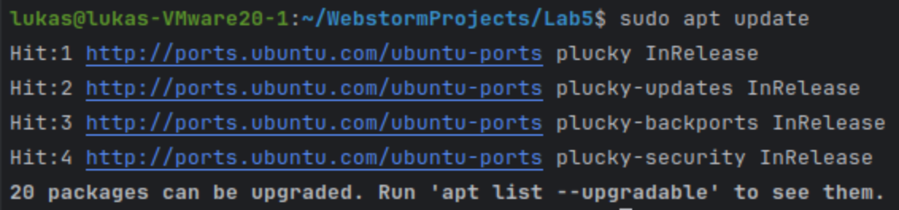
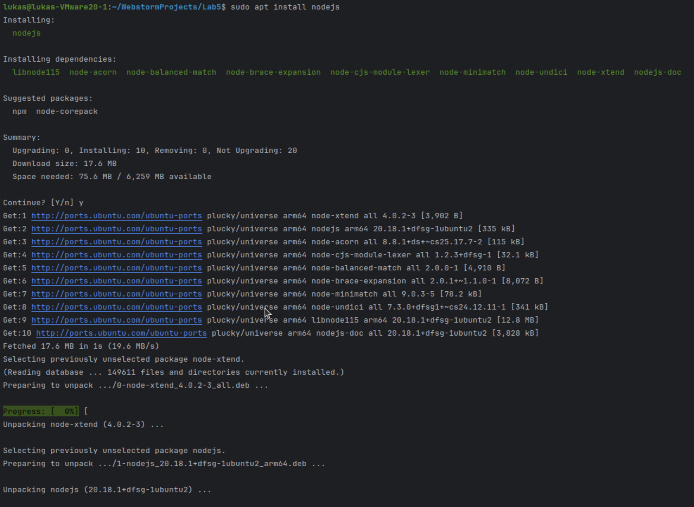
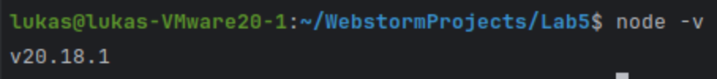
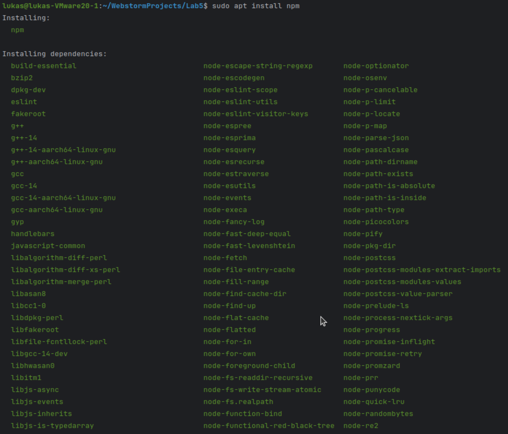
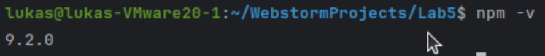
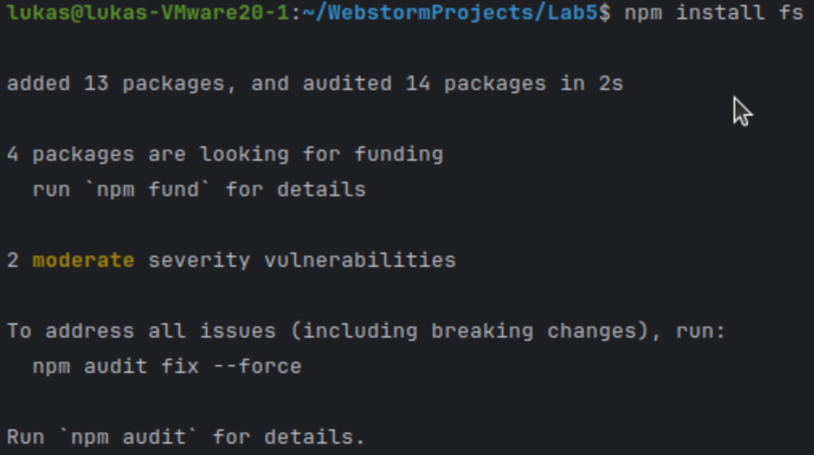

# Labor 5: Dynamische Webseiten mit JavaScript

## 1. Erweitern der Laborumgebung

### 1.1 GitHub - Repositry und Webstorm
#### Abb. 1: Erstellung eines GitHub-Tokens:

#### Abb. 2: Hinterlegen des Tokens in in Webstorm und clonen eines bereits bestehenden Repositories:

### 1.2 NodeJS - Webserver

#### Abb. 3: Sudo apt update

#### Abb. 4: Sudo apt install nodejs

#### Abb. 5: node -v

#### Abb. 6: sudo apt install npm

#### Abb. 7: npm -v

#### Abb. 8: npm install fs

## 2. Erstellen von dynamischen Webseiten

- **`app.js`:**\
    NodeJS-Code (mit Hilfe von Express), der den Webserver startet und die verschiedenen Routen definiert (hier mit einem sehr einfachen Setup mit wenig Middleware und ohne eigene Router)
- **`users.json`:**\
    JSON-Datei mit dem Userdatensatz
- **Verzeichnis `/public`:**
  - `index.html`: Unter Route `/` aufgerufenes Login-Formular und Registrierungs-Verlinkung
  - `register.html`: Registrierungs-Formular
  - `content.html`: Anzuzeigende Inhalte - Kann aktuell auch ohne vorherigen Login aufgerufen werden (durch Navigation in URI-Zeile). In diesem Fall werden jedoch keine Inhalte angezeigt.
  - `styles.css`: CSS-Styles für die HTML-Seiten
  - `script.js`: JavaScript-Script, das die clientseitige Funktionalität der verschiedenen Seiten implementiert